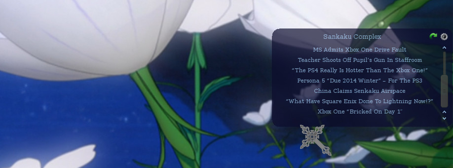
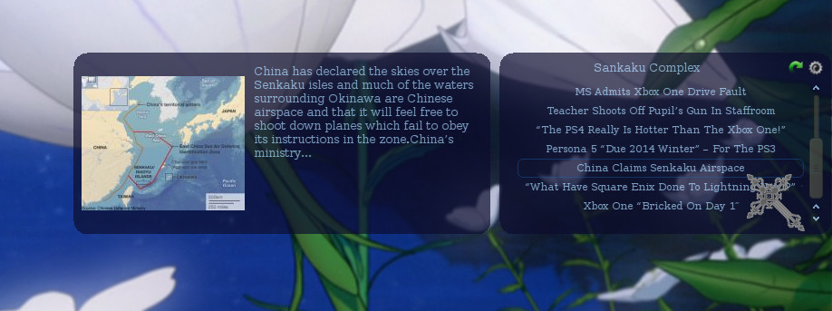

rss
===

A QT RSS reader desktop widget.

This project is an RSS reader desktop widget. It is designed with a translucent background allowing it to unintrusively sit on the desktop background. The GUI and image manipulation components use the QT4 framework. Custom EBNF grammars have been written to do all the parsing of RSS data, HTML data and unicode characters. The grammars are implemented with boost:spirit and phoenix. The fetching of remote content is done with libcurl.

Below is a screenshot of the main window attached to the right hand side of the desktop. At the top it shows the title of the current RSS feed along with a refresh button and a settings button. Below is a list of RSS item titles. Each one can be clicked to bring up more information about.

Below is a screenshot of the description window. It presents the description text of the RSS item along with a scaled preview picture if one is available. 

